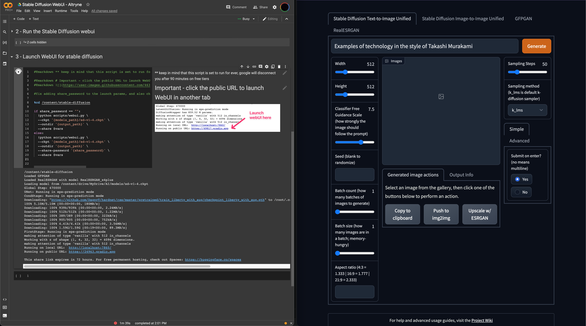
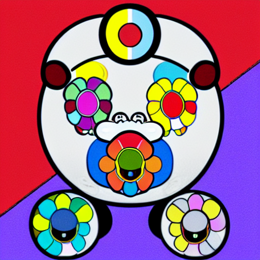
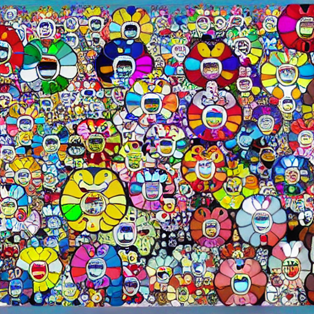
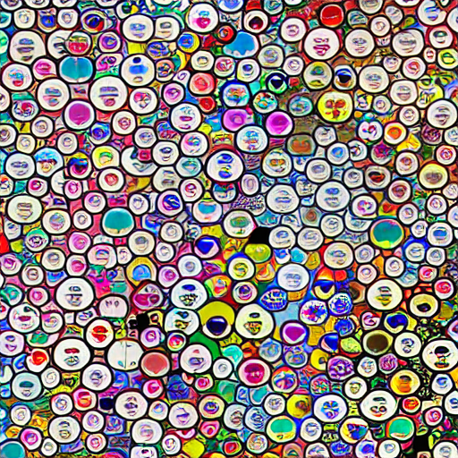
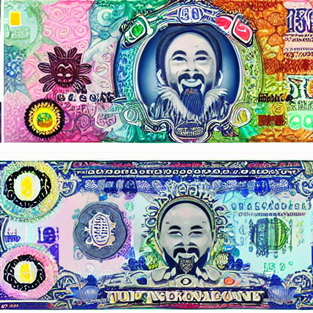
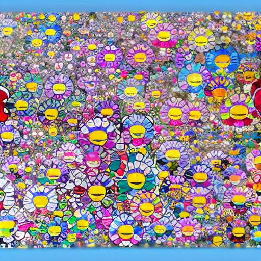
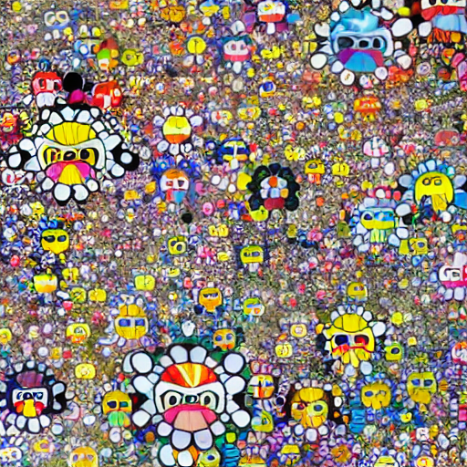
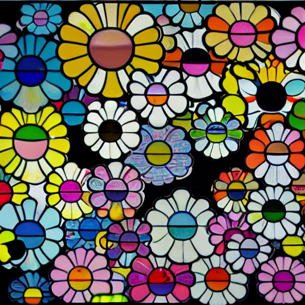
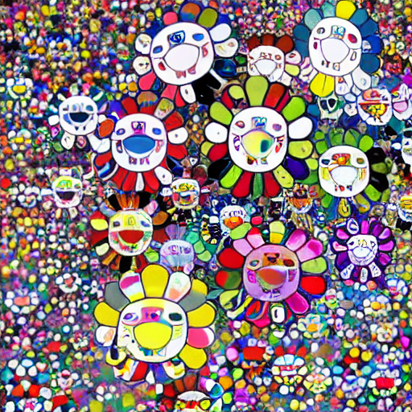

# Stable Diffusion - Stability AI

Examples of generated art from [Stable Diffusion](https://huggingface.co/CompVis/stable-diffusion-v1-4):

0. Google Colab Pro (left) and SD Gradio Interface (right) side-by-side
   
   
2. **Prompt:** "Examples of technology in the style of Takashi Murakami"
   

3. **Prompt:** "Examples of society in the style of Takashi Murakami"
   

4. **Prompt:** "Examples of economy in the style of Takashi Murakami"
   

5. **Prompt:** "Examples of money in the style of Takashi Murakami"
    

6. **Prompt:** "Examples of policy in the style of Takashi Murakami"
   

7. **Prompt:** "Examples of law in the style of Takashi Murakami"
   
   
8. **Prompt:** "Examples of rules in the style of Takashi Murakami" 
   

9. **Prompt:** "Rules in the style of Takashi Murakami"  
    
